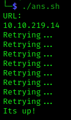

# ISUP

# Descrição:
O objetivo desse programa é usar um while loop de *curl* para conferir se uma URL já está disponível. Ele usa a resposta do curl para filtrar quando houver uma resposta 200 ou 301.

# Modo de uso:
./isup.sh suaurl.com

## Observações:
- Como ele é um loop, se a resposta da URL não for 200 ou 301, o programa continuará rodando indefinidamente. Ctrl+C mata a execução.
- Recomenda-se o uso dele com máquinas de ctf que têm um tempo de espera para o início dos serviços http, como as do TryHackMe.
